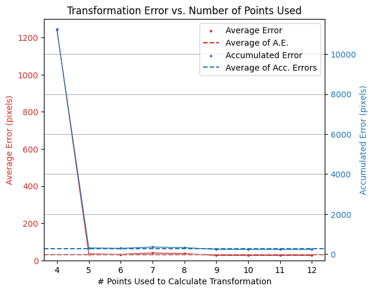
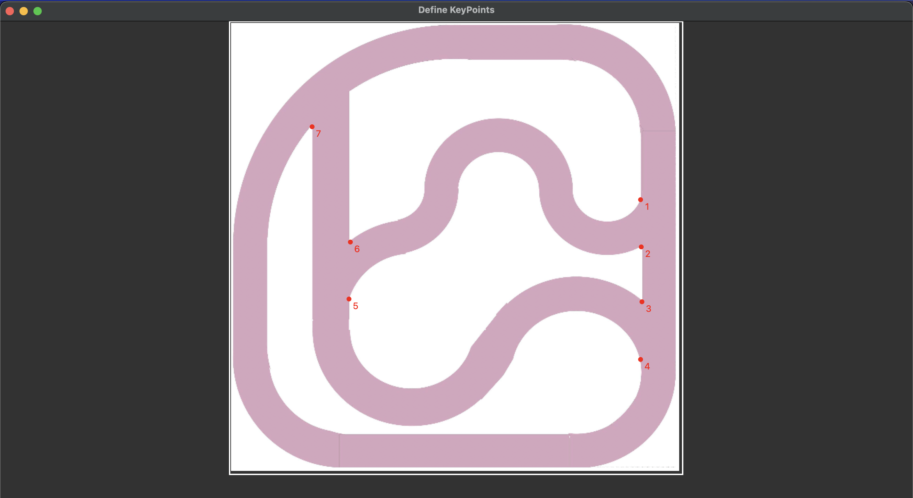
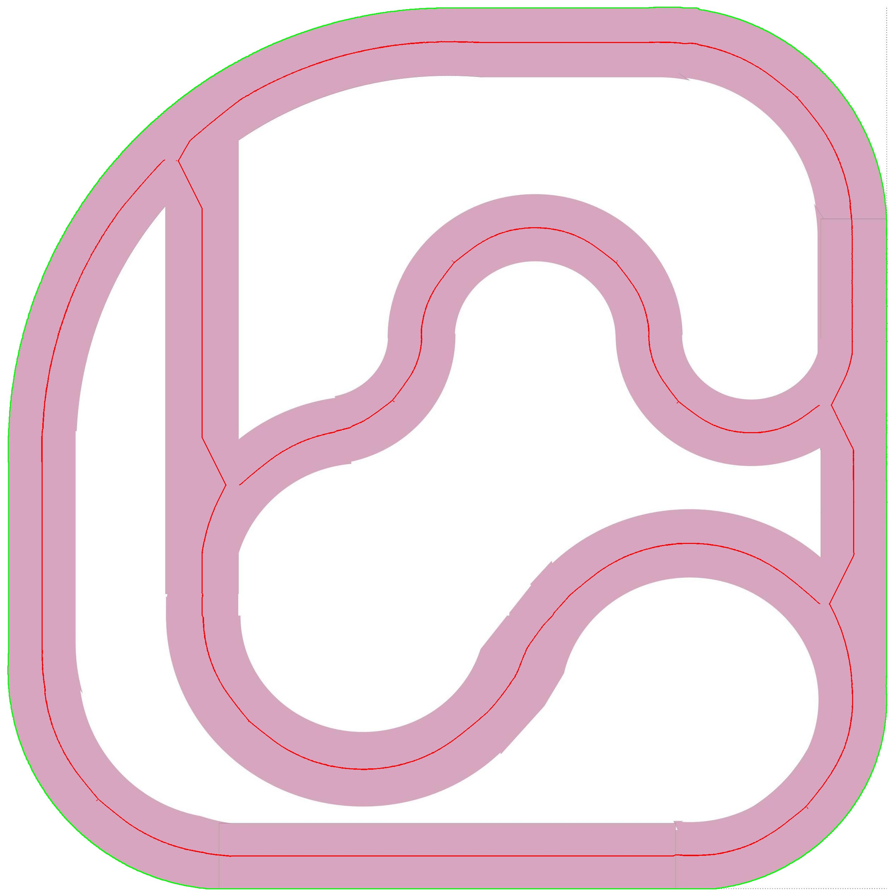

# DriveNetBench

DriveNetBench is a comprehensive benchmarking repository for evaluating neural networks designed for autonomous driving control.
[](https://buymeacoffee.com/alibustami)


## Project Description

DriveNetBench is a benchmarking tool designed to evaluate the performance of neural networks for autonomous driving control. The tool uses a single camera to navigate predefined tracks and provides metrics to assess the accuracy and efficiency of the neural networks. The main features of DriveNetBench include:

- Detection and tracking of the robot using a YOLO model.
- Calculation of path similarity using Dynamic Time Warping (DTW) or Frechet distance.
- Extraction and processing of track images to define keypoints and paths.
- Visualization of the robot's path and track.

## Requirements

- Miniconda or Anaconda

## Installation

To install DriveNetBench, follow these steps:

1. Clone the repository:
   ```bash
   git clone https://github.com/alibustami/DriveNetBench.git
   cd DriveNetBench
   ```
### Unix
2. Create a virtual environment and build the package:
   ```bash
   make create-venv
   ```

### Windows
2. Create a virtual environment and build the package:
   ```
   conda create -n drivenetbench python=3.8
   conda activate drivenetbench
   python -m pip install --upgrade pip
   python -m pip install --upgrade setuptools wheel
   python -m pip install -e .
   pre-commit install
   ```

## Configuration

The `config.yaml` file is the only file you need to modify in the entire repository. This file contains all the necessary configurations for running the benchmark.

### Configuration Parameters

The `config.yaml` file contains the following parameters:
- `Benchmarker` class:
   - `benchmarker.video_path`: The path to the video file to be benchmarked.
   - `benchmarker.detection_model.model_path`: The path to the YOLO model weights.
   - `benchmarker.detection_model.conf_threshold`: The confidence threshold for the YOLO model.
   - `benchmarker.detection_model.shift_ratio`: The ratio to shift the detection centroid to the bottom from the top.
       > if the detection centriod is at the very bottom of the image the shift value will be 0.0 pixels, but if the detection centroid is at the very top of the image the shift value `shift_ratio` * `frame_height` pixels.
   - `benchmarker.track_image_path`: The path to the track image.
   - `benchmarker.reference_track_npy_path`: The path to the reference track numpy file (generated by the [`TrackProcessor`](https://github.com/alibustami/DriveNetBench/blob/7df9007bed8fb125752df4b8950018982b411c0c/drivenetbench/utilities/track_processor.py#L15) class).
   - `benchmarker.path_similarity.method`: The method used to calculate the path similarity. The available methods are `dtw` and `frechet`.
   - `benchmarker.path_similarity.auto_tune`: A boolean value indicating whether to automatically tune the path similarity parameter `clamp_distance` and `distance_baseline`.
   - `benchmarker.path_similarity.clamp_percentage`: The percentage of the path length to be used as the clamp distance.
   - `benchmarker.path_similarity.clamp_distance`: The maximum distance between two points to be considered as a match.
   - `benchmarker.path_similarity.distance_baseline`: The distance baseline for the matching points.
       > if the `auto_tune` is set to `True`, the `clamp_distance` and `distance_baseline` will be automatically tuned.
   - `benchmarker.time.distance_threshold_in_pixels`: The linear distance between the robot's starting point and ending point to be considered as a full rotation.
   - `benchmarker.time.skip_first_x_seconds`: The number of seconds to skip at the beginning of the video.
- `ViewTransform` class:
  - `view_transformer.source_path`: The path to the source image (the image from the camera view).
  - `view_transformer.target_path`: The path to the target image (the image from the digital graph).
- `KeyPointsDefiner` class:
  - `keypoints_definer.source_path`: The path of the image to define the keypoints from.
  - `keypoints_definer.output_name`: The name of the output file to save the keypoints -including the extension-.
  - `keypoints_definer.frame_number`: The frame number to define the keypoints from, if the source is a video. Otherwise, set 1.
  - `keypoints_definer.override_if_exists`: A boolean value indicating whether to override the output file if it already exists.
- `TrackProcessor` class:
  - `track_processor.image_path`: The path to the track image.
  - `track_processor.color_hsv`: The color of the track in HSV format. https://pinetools.com/image-color-picker was used to get the HSV values.
  - `track_processor.output_image_path_export`: The path to save the processed track image, including the file extension.
  - `track_processor.output_npy_path_export`: The path to save the processed track numpy file, including the file extension (.npy).
  - `track_processor.only_offset_the_outer`: A boolean value indicating whether to only offset the outer track.
  - `track_processor.dbscan.eps`: The maximum distance between two samples for one to be considered as in the neighborhood of the other.
  - `track_processor.dbscan.min_samples`: The number of samples in a neighborhood for a point to be considered as a core point.
  - `track_processor.dbscan.cluster_size_threshold`: The minimum number of points in a cluster to be considered as a track.
- General parameters, `actions` objects:
  - `actions.early_stop_after_x_seconds`: The number of seconds to wait before stopping the benchmark, leave empty to disable.
  - `actions.show_live`: A boolean value indicating whether to show the live video feed.
  - `actions.save_live_to_disk`: A boolean value indicating whether to save the live video feed to disk.

## Usage

Keep in mind all parameters and configurations related to the project are stored in the `config.yaml` file.

1. Define the keypoints:
   1.1 Define the keypoints from the digital graph, specify the `keypoints_definer.source_path` in the config.yaml file to the digital track image.
   ```bash
   drivenetbench define-keypoints --config-file config.yaml
   ```

   commands for the `DefineKeyPoints` class:
   1. press `z` to remove the last point.
   2. press `q` to save the points and exit.


   1.2 Change the path of the `keypoints_definer.source_path` in the config.yaml to your source path. Then re-run the previous command.

   > ⚠️ Ensure that points order is the same, otherwise the view transformation will not work correctly.

   > you can run the `notebooks/calculate_transformation_error.ipynb` to check your view transformation. You will end up with a plot showing the transformation error. like the following:
   

   Example of the keypoints definition:
   3. Define the keypoints from the digital graph
      
   4. Define the keypoints from the camera view
      

   > See how the keypoints orders are the same.

2. Extract the track from the image:
   ```bash
   drivenetbench extract-track --config-file config.yaml
   ```

   You will end up with:
   - the track as npy file.
   - the track drawn on the image, as shown below:
     

3. Run the benchmark:
   ```bash
   drivenetbench benchmark --config-file config.yaml
   ```

The results of the benchmark will be saved in the `results` directory. The results include the time taken for the robot to complete a full rotation and the similarity percentage between the robot's path and the reference path.

## Contributing

We welcome contributions to DriveNetBench! If you have any ideas, suggestions, or bug reports, please open an issue on GitHub. If you would like to contribute code, please follow these guidelines:

1. Fork the repository and create a new branch for your feature or bugfix.
2. Write tests for your changes and ensure that all tests pass.
3. Submit a pull request with a clear description of your changes.

## License

DriveNetBench is licensed under the MIT License. See the [LICENSE](LICENSE) file for more information.
